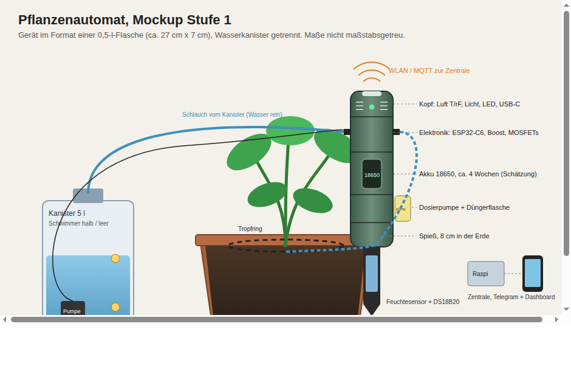

# AI_Bros: Pflanzenautomat

Ein Gerät im Format einer 0,5-l-Bierflasche, das eine Zimmerpflanze über Jahre gesund hält:
es misst, gießt bei Bedarf, dosiert Nährstoffe und meldet aufs Handy, wenn Wasser oder Dünger
nachgefüllt werden müssen.

Hobbyprojekt zu dritt (zwei Embedded-Entwickler, Löten möglich). Budget 300 Euro.
Zieltermin: fertig bis spätestens **März 2027**.

## Ziele

| Stufe | Ziel | Status |
|---|---|---|
| 1 | Eine Topfpflanze drinnen am Fensterbrett, Netzteil oder Akku, lokale Anbindung im Heimnetz | in Planung |
| 2 | Mehrere Töpfe an einer Zentrale | später |
| 3 | Hydroponik mit pH/EC-Regelung | später |

## Repo-Struktur

```
README.md                 Dieser Überblick
docs/                     Wissensbasis (alles Deutsch)
  01-anforderungen.md
  02-systemarchitektur.md
  03-sensorik.md
  04-aktorik.md
  05-stueckliste.md
  06-stromversorgung.md
  07-firmware-konzept.md
  08-zentrale-und-handy.md
  09-mechanik-gehaeuse.md
  10-pflegeregeln.md
  11-meilensteine.md
  12-risiken-offene-fragen.md
mockup/                   Visuelles Mockup des Geräts (SVG, PNG, HTML)
firmware/                 ESP32-Firmware (noch leer)
backend/                  Zentrale: MQTT, Datenbank, Dashboard, Benachrichtigung (noch leer)
app/                      Handy-Oberfläche, falls eigene App gebaut wird (noch leer)
```

## Kurzfassung der Architektur

```
[Gerät am Topf]                          [Zentrale im Heimnetz]        [Handy]
 ESP32-C6 + Akku                          Raspberry Pi                   Telegram /
 Bodenfeuchte, Bodentemp.,   --WLAN/MQTT-->  Mosquitto (MQTT)  ---->     Web-Dashboard
 Luft T/rF, Licht, Tankstand              Datenbank + Dashboard
 Wasserpumpe, Dosierpumpe   <--Befehle---  Regeln + Benachrichtigung
```

Details in `docs/02-systemarchitektur.md`.

## Wie wir arbeiten

- Alles Wissen landet hier im Repo, nicht im Chat.
- Preise in der Stückliste sind Schätzungen mit Datum, vor dem Bestellen prüfen.
- Änderungen an Doku per Pull Request oder direkt auf `main`, wie es dem Team passt.
- Meilensteine in `docs/11-meilensteine.md`, Offenes in `docs/12-risiken-offene-fragen.md`.

## Mockup


