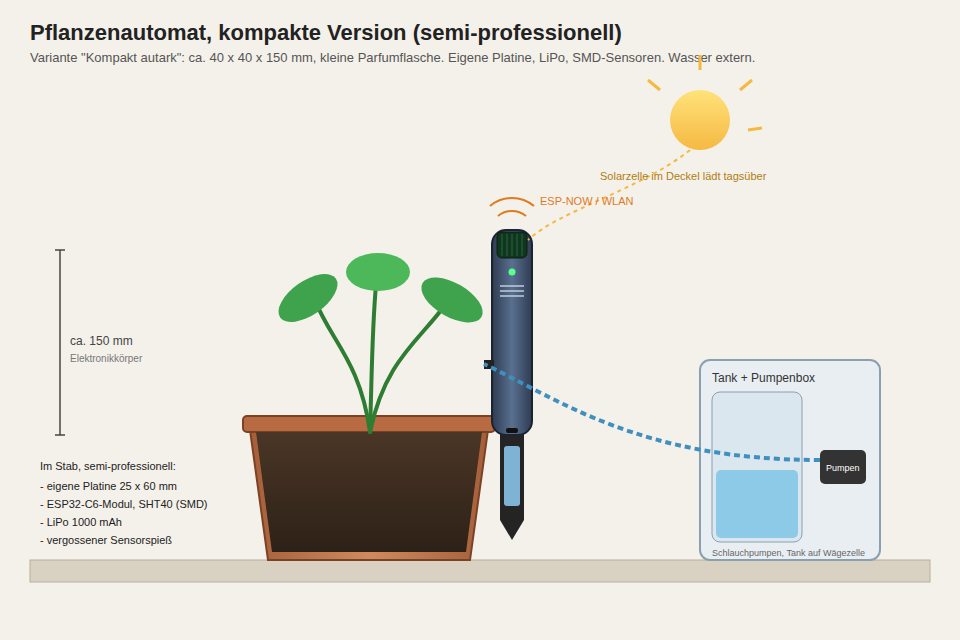

# AI_Bros: Pflanzenautomat (Smart Plant Care)

Ein Gerät, das eine Zimmerpflanze über Jahre selbstständig gesund hält. Es misst die
Bodenfeuchte, gießt morgens bei Bedarf, düngt nach Plan, überwacht Wasser- und Düngervorrat und
meldet aufs Handy. Hobbyprojekt zu dritt, Budget 300 Euro, Stufe 1 fertig bis spätestens März 2027.

**Maßgeblich für Stufe 1: [`docs/00-spezifikation-stufe1.md`](docs/00-spezifikation-stufe1.md)**
(Anforderungen, Hardware, Firmware, MQTT, Sicherheitslogik, Tests, offene Entscheidungen).
Arbeitsregeln für Claude Code: [`CLAUDE.md`](CLAUDE.md).

## Stufen

| Stufe | Inhalt | Status |
|---|---|---|
| 1 | Tischprototyp am Netzteil: kompletter Regelkreis Messen, Entscheiden, Dosieren, Überwachen, Protokollieren, Melden | Spezifikation v1.2, M0 läuft |
| 2 | Autarkes Gerät: Akku, Deep Sleep mit einmal täglich messen, Gehäuse vom A1 Mini, Formfaktor, ggf. Tank im Gerät | Ausblick |
| 3 | Mehrere Töpfe an einer Zentrale | später |
| 4 | Hydroponik mit pH- und EC-Regelung | später |
| 5 | Pilz-Growbox mit gleicher Elektronik | Idee |

## Architektur Stufe 1

```
Topf ← Sonde, Pumpen ← ESP32-C6 (ESPHome) ⇄ WLAN/MQTT ⇄ Raspi (Mosquitto + Home Assistant + NTP) → Dashboard, Push
```

Der Node entscheidet lokal und hält die Sicherheitsgrenzen selbst ein. Der Raspi liefert
Parameter und Zeit, speichert Verläufe, erkennt fehlende Lebenszeichen und alarmiert. Hardware:
FireBeetle 2 ESP32-C6, kapazitive Sonde, zwei Schlauchpumpen am DRV8833, Wägezellen unter Wassertank
und Düngerbehälter.

## Repo-Struktur

```
CLAUDE.md                 Arbeitsregeln (Kurzfassung von Spezifikation Abschnitt 0)
docs/
  00-spezifikation-stufe1.md   maßgeblich für Stufe 1
  01-anforderungen.md          Vision, Rahmen, Stufen, Kickoff-Vorgaben
  02-systemarchitektur.md      Überblick und Erweiterungen
  03-sensorik.md               Sensorauswahl, Nährstoffe, Kalibrierung
  04-aktorik.md                Pumpen, Treiber, Auslass
  05-stueckliste.md            Kaufkriterien, Bestellreihenfolge, Budget
  06-stromversorgung.md        Akku und Laufzeit (Stufe 2)
  07-firmware-konzept.md       ESPHome plus plant_logic
  08-zentrale-und-handy.md     Home Assistant, Push, Datenhaltung
  09-mechanik-gehaeuse.md      Gehäuse, Formfaktor, Tank (Stufe 2)
  10-pflegeregeln.md           Gießen, Düngen, Vorräte, Pflanzenprofile
  11-meilensteine.md           M0 bis M5, Rollen, Ablauf
  12-risiken-offene-fragen.md  Risiken, Fragen zu späteren Stufen, Erledigtes
  13-retros.md                 Retros je Meilenstein
  14-pilzzucht.md              Stufe 5, Idee
  15-messintervalle.md         Wie oft messen, entscheiden, senden
firmware/                 ESPHome-YAML, secrets.yaml (ignoriert)
  components/plant_logic/ Entscheidungslogik ohne I/O
  test/                   Host-Unit-Tests
homeassistant/            Dashboards, Automationen, Mosquitto-Config
hardware/                 Verdrahtung, Fotos
calibration/              Protokolle Sonde, Pumpen, Wägezellen
data/                     Exporte für die spätere Auswertung
mockup/                   Skizzen für Stufe 2
```

## Wie wir arbeiten

- Die Spezifikation ist maßgeblich. Änderungen dort mit neuer Version und Eintrag in Abschnitt 15.
- Meilensteine M1 bis M5 der Reihe nach (`docs/11-meilensteine.md`), Retros in `docs/13-retros.md`.
- Offene Entscheidungen (Spezifikation Abschnitt 10) nicht stillschweigend treffen.
- Preise und nicht gemessene Werte als Schätzung kennzeichnen, Platzhalter als (P).

## Mockups (Ausblick Stufe 2)

Gerät im Flaschenformat, Tank getrennt auf Wägezelle:


Kompakte, semi-professionelle Variante:


